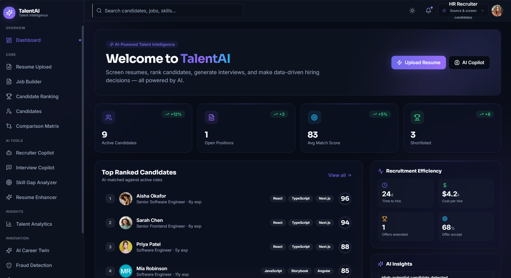
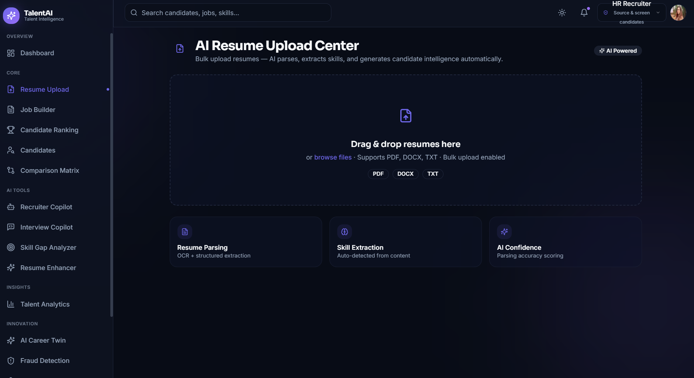
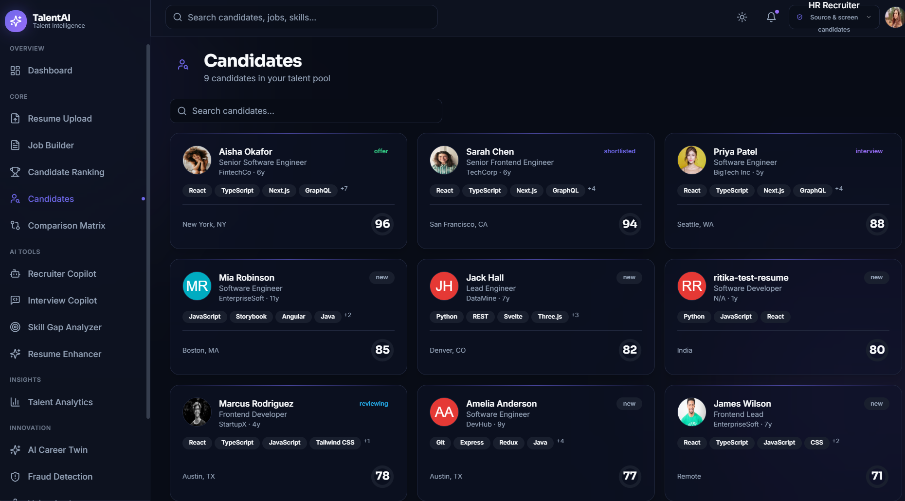
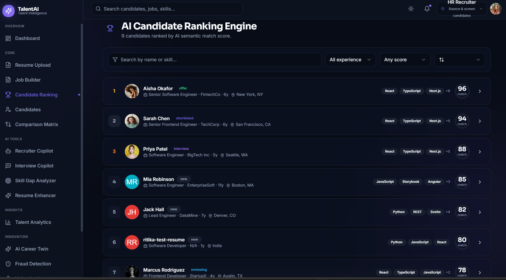
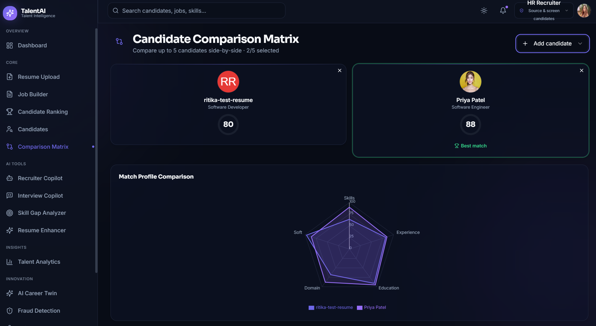
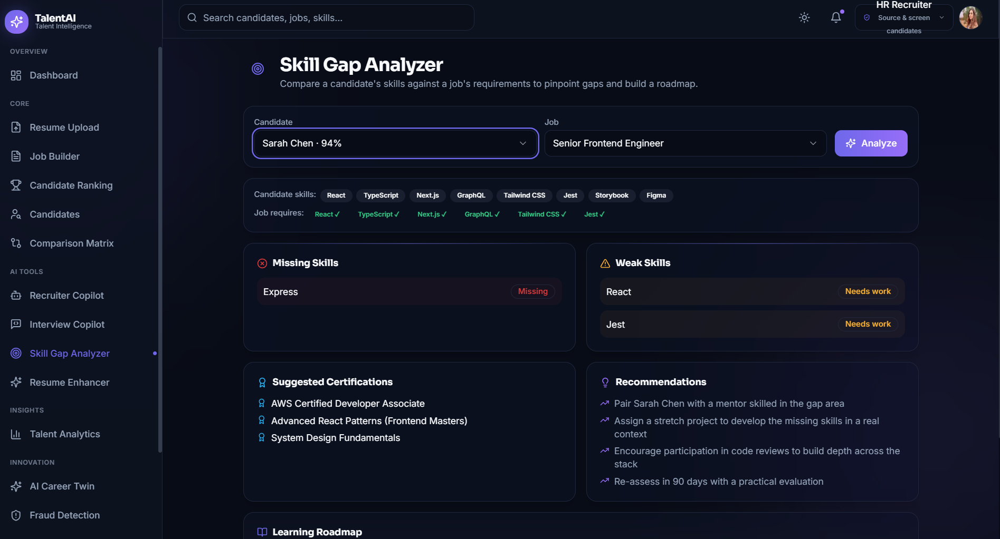
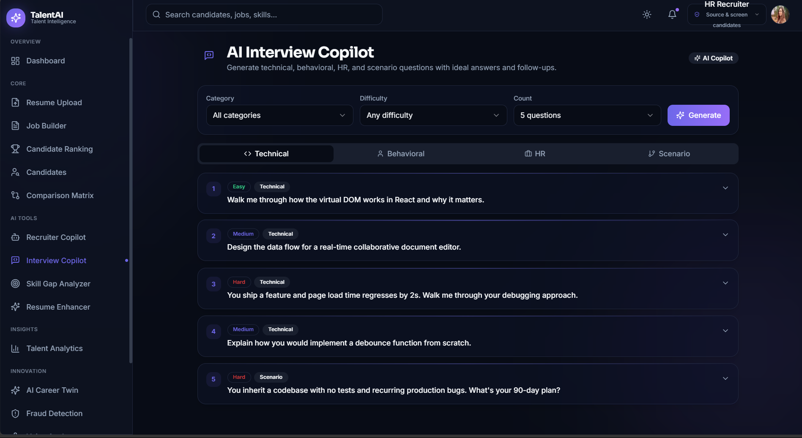

<div align="center">

<br/>


# TalentAI
## AI-Powered Resume Screening & Candidate Intelligence Platform

*Screen smarter. Hire faster. Decide with data.*

<br/>

[](https://nextjs.org/)
[](https://www.typescriptlang.org/)
[](https://react.dev/)
[](https://supabase.com/)
[](https://www.postgresql.org/)
[](https://tailwindcss.com/)
[](https://www.framer.com/motion/)

<br/>


</div>

---

<div align="center">

### 🚀 TalentAI eliminates the most painful part of hiring — manual resume screening.
Upload resumes → get instant AI candidate intelligence → rank → compare → decide.

</div>

---

## 📸 Platform Preview

### 🏠 Dashboard — Recruitment Command Center
> Real-time analytics, top-ranked candidates, hiring metrics, AI insights — all at a glance.



---

### 📄 AI Resume Upload Center
> Bulk upload PDF / DOCX / TXT resumes. AI parses, extracts skills, and generates full candidate intelligence automatically.



---

### 👥 Candidate Management
> Browse your entire talent pool with match scores, skills, location, status badges, and experience — searchable and filterable.



---

### 🏆 AI Candidate Ranking Engine
> Every candidate ranked by AI semantic match score. Filter by experience, score range, and sort by any dimension.



---

### ⚖️ Candidate Comparison Matrix
> Compare up to 5 candidates side-by-side. Radar chart visualizes Skills, Experience, Education, Domain & Soft skills.



---

### 📊 Skill Gap Analyzer
> Pinpoints missing & weak skills vs job requirements. Suggests certifications and builds a personalized learning roadmap.



---

### 🎤 AI Interview Copilot
> Generates Technical, Behavioral, HR & Scenario questions with difficulty tags — tailored per candidate and role.



---

## 📌 Features

<table>
<tr>
<td width="50%">

### 📄 Resume Upload Center
- Upload PDF, DOCX, TXT (bulk supported)
- Automatic OCR + structured extraction
- AI confidence scoring on parsing
- Instant candidate profile generation

### 🤖 AI Candidate Intelligence
- Match score (0–100 scale)
- AI-generated candidate summaries
- Strengths & weaknesses analysis
- Leadership potential scoring
- Communication assessment
- Culture fit analysis
- Career growth prediction
- Job switch probability
- Fraud risk scoring

### 👥 Candidate Management
- Searchable candidate database
- Detailed candidate profiles
- Status tracking (New → Interview → Offer)
- Filter by skills, experience, score

</td>
<td width="50%">

### 🏆 Candidate Ranking Engine
- AI semantic match scoring
- Filter by experience & score range
- Top talent identification

### ⚖️ Comparison Matrix
- Side-by-side comparison (up to 5)
- Radar chart across 5 dimensions
- Best match highlighting

### 📊 Skill Gap Analyzer
- Missing skill detection vs job requirements
- Weak skill identification
- Suggested certifications
- Personalized learning roadmap

### 🎤 Interview Copilot
- Technical / Behavioral / HR / Scenario questions
- Easy / Medium / Hard difficulty levels
- Candidate-specific preparation

### 🛡️ Fraud Detection
- Risk indicator flagging
- Profile consistency validation
- Fraud risk score per candidate

### 📈 Analytics Dashboard
- Time to hire & cost per hire
- Offer acceptance rate
- AI-generated recruitment insights

</td>
</tr>
</table>

---

## 🛠️ Tech Stack

| Layer | Technology | Purpose |
|---|---|---|
| **Frontend** | Next.js 13 + React.js | App Router, SSR, UI components |
| **Language** | TypeScript | Type safety & better DX |
| **Styling** | Tailwind CSS | Utility-first rapid UI |
| **Animation** | Framer Motion | Smooth UI transitions |
| **Backend** | Supabase | Auth, Realtime, Storage, Edge Functions |
| **Database** | PostgreSQL (via Supabase) | Relational data with RLS |
| **Dev Tools** | VS Code, Git, GitHub, Bolt.new | Development & version control |

---

## 📂 Project Structure

```
TalentAI/
├── app/                        # Next.js 13 App Router
│   ├── dashboard/              # Main dashboard
│   ├── candidates/             # Candidate management
│   ├── ranking/                # AI ranking engine
│   ├── comparison/             # Comparison matrix
│   ├── skill-gap/              # Skill gap analyzer
│   ├── interview/              # Interview copilot
│   ├── job-builder/            # Job posting management
│   └── fraud-detection/        # Fraud risk module
├── components/                 # Reusable React components
├── hooks/                      # Custom React hooks
├── lib/                        # Utility functions & helpers
├── supabase/                   # DB schema, types, migrations
└── screenshots/                # Platform screenshots
```

---

## 🗄️ Database Schema

| Table | Primary Fields | Purpose |
|---|---|---|
| `jobs` | id, title, description, required_skills, salary_range | Job postings & requirements |
| `candidates` | id, name, email, skills, match_score, ai_summary, fraud_risk_score | Central candidate intelligence |
| `interview_questions` | id, candidate_id, job_id, question, type, difficulty | AI-generated questions |
| `skill_gaps` | id, candidate_id, missing_skill, priority, recommendation | Skill gap records & roadmaps |
| `hiring_decisions` | id, candidate_id, recruiter_id, decision, rating, feedback | Recruiter decisions |
| `activity_log` | id, user_id, action, entity_type, timestamp | Full audit trail |

---

## 🔄 System Workflow

```
📤 Resume Upload
        ↓
🔍 Resume Parsing  (OCR + Structured Extraction)
        ↓
🤖 AI Intelligence Generation
   ├── Match Score Calculation
   ├── Strengths & Weaknesses
   ├── Leadership / Culture Fit Scoring
   └── Fraud Risk Detection
        ↓
🗄️ Database Storage  (PostgreSQL via Supabase)
        ↓
🏆 Candidate Ranking  (AI Semantic Match)
        ↓
📊 Skill Gap Analysis + Learning Roadmap
        ↓
🎤 Interview Preparation  (AI-Generated Questions)
        ↓
✅ Hiring Decision Support
```

---

## 🚀 Installation & Setup

### Prerequisites
- Node.js 18+
- npm or yarn
- Supabase account (free tier works)

### 1. Clone the repository

```bash
git clone https://github.com/ritikatripathi11111/TalentAI.git
cd TalentAI
```

### 2. Install dependencies

```bash
npm install
```

### 3. Configure environment variables

Create a `.env.local` file in the root directory:

```env
NEXT_PUBLIC_SUPABASE_URL=your_supabase_project_url
NEXT_PUBLIC_SUPABASE_ANON_KEY=your_supabase_anon_key
```

> Get these from your [Supabase Dashboard](https://supabase.com) → Project Settings → API

### 4. Run the development server

```bash
npm run dev
```

Open [http://localhost:3000](http://localhost:3000) in your browser.

### 5. Build for production

```bash
npm run build
npm start
```

---

## 🎯 Project Objectives

- ✅ Automate resume screening and eliminate manual recruiter effort
- ✅ Generate AI-driven multi-dimensional candidate intelligence
- ✅ Rank candidates objectively by match score against job requirements
- ✅ Identify skill gaps and provide personalized learning roadmaps
- ✅ Support data-driven hiring decisions with structured feedback
- ✅ Detect fraudulent or inconsistent candidate profiles
- ✅ Provide a centralized end-to-end recruitment management platform

---

## 🔮 Future Enhancements

- [ ] 🧠 Gemini / OpenAI API integration for deeper AI analysis
- [ ] 🔍 Real resume OCR processing for scanned PDFs
- [ ] 📧 Email integration for automated candidate communication
- [ ] 🔗 ATS (Applicant Tracking System) integration
- [ ] 🎥 AI video interview evaluation
- [ ] 📄 Resume recommendation engine
- [ ] 💬 Recruitment chatbot assistant
- [ ] 📊 Advanced predictive hiring analytics
- [ ] 📱 Mobile application (React Native / Flutter)
- [ ] 🌐 Multi-language resume support

---

## 👩‍💻 Author

<div align="center">

**Ritika Tripathi**

B.Tech Computer Science & Engineering
Allenhouse Institute of Technology, Kanpur
Dr. A.P.J. Abdul Kalam Technical University (AKTU), Lucknow
2023 – 2027

[](https://github.com/ritikatripathi11111)

</div>

---

## 📜 License

This project is developed for **educational and academic purposes** as a B.Tech Major Project.
Not intended for commercial use.

---

<div align="center">

Made with ❤️ by **Ritika Tripathi**

*If this project helped you, please give it a ⭐ — it means a lot!*

</div>
